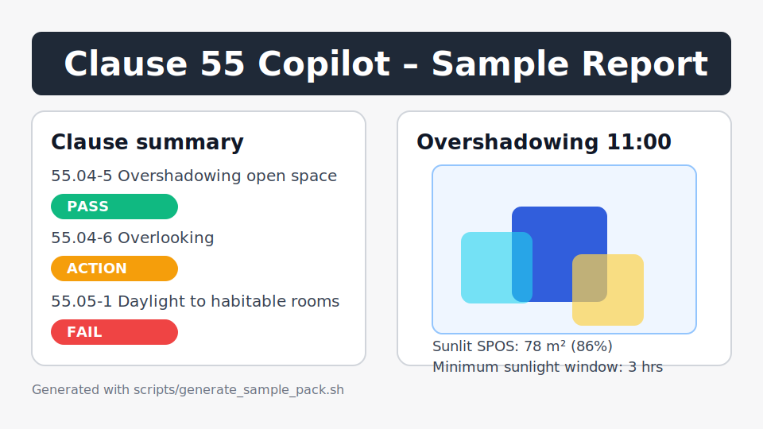

# Clause55 Copilot

Clause55 Copilot ingests a site and massing model, evaluates Clause 55 (ResCode) compliance, and exports a planner-ready PDF pack with matrix, diagrams, and citations. It is designed for fast iteration during early design and planning submissions.



## Features

- Site, lot, building, opening, SPOS, and report spec models powered by Pydantic.
- Geometry utilities (setbacks, distances, unions) using Shapely and PyProj.
- Solar position calculations with PySolar (and NOAA fallback) plus shadow casting for SPOS oversight.
- Clause 55 rule metadata in YAML and Python check functions for setbacks, overlooking, overshadowing, and rooftop solar.
- Export pipeline generating WeasyPrint PDFs, hourly shadow figures via Matplotlib, and an XLSX clause matrix.
- FastAPI service with `/analyze` endpoint and React/Vite front-end for uploads and results.
- CLI (`c55 run`) for offline workflows, sample data, and batch mode (requires license key).
- Telemetry stub writing local counts only when `C55_TELEMETRY=1` is set.

## Getting started

### 1. Install dependencies

```bash
python -m venv .venv
source .venv/bin/activate
pip install -e .[ifc]
```

Install front-end dependencies:

```bash
cd webapp
npm install
```

### 2. Run the API

```bash
uvicorn src.c55copilot.api.main:app --reload
```

Check the health endpoint:

```bash
curl http://127.0.0.1:8000/health
```

### 3. Use the CLI

```bash
c55 run --site src/c55copilot/assets/samples/site_fitzroy.json \
         --massing src/c55copilot/assets/samples/massing_two_townhouses.json \
         --property src/c55copilot/assets/samples/property_report_mock.json \
         --out out/
```

Outputs include `out/report.pdf`, `out/matrix.xlsx`, and hourly figures under `out/figures/`.

### 4. Launch the web app

```bash
cd webapp
npm run dev
```

Upload the sample site and massing JSON, tick the mock property report option, and review clause results and downloads.

## Rules and reports

- Rules live in `src/c55copilot/rules/victoria_clause55.yaml`. Add new clauses by creating handler functions under `src/c55copilot/domain/checks/standards/` and referencing them in the YAML.
- HTML templates (`cover.html`, `report.html`) and styles live under `src/c55copilot/assets/templates/`.
- `scripts/generate_sample_pack.sh` runs the CLI, stages outputs, and copies `report_preview.svg` for quick README screenshots.

## Tests and quality

```bash
pytest
```

Ruff and MyPy are configured via `pyproject.toml`, and `.pre-commit-config.yaml` wires them into git hooks.

## Telemetry and privacy

Telemetry is **opt-in**. Set `C55_TELEMETRY=1` to log anonymous local usage counts to `out/telemetry.json`. No data leaves your machine.

## Pro upgrades

Set `C55_LICENSE_KEY` to unlock white-label PDFs (brand watermark removed) and CLI batch mode via `--batch`. Suggested Pro pricing: **AUD $89/month**. [Contact us](https://example.com/pro) for tailored support.

## Limitations

Clause55 Copilot provides indicative compliance guidance only. Always engage a qualified planner or building surveyor before lodging statutory applications.
